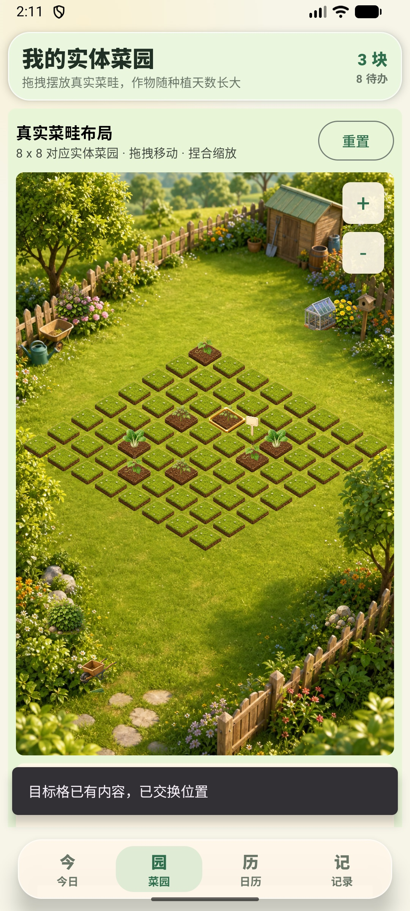
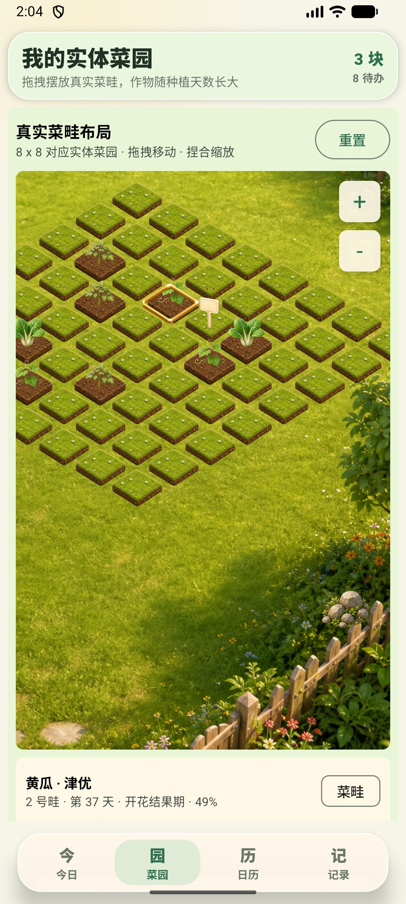
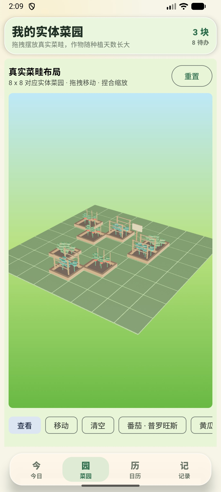
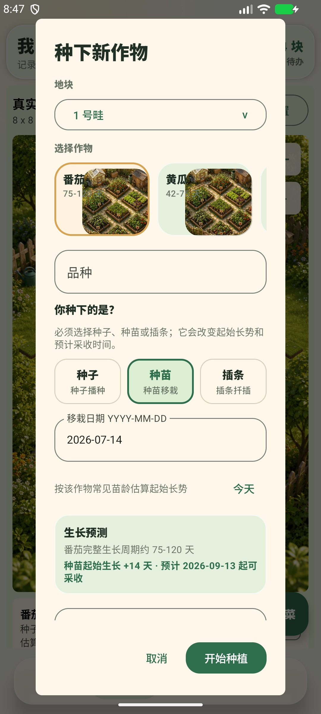
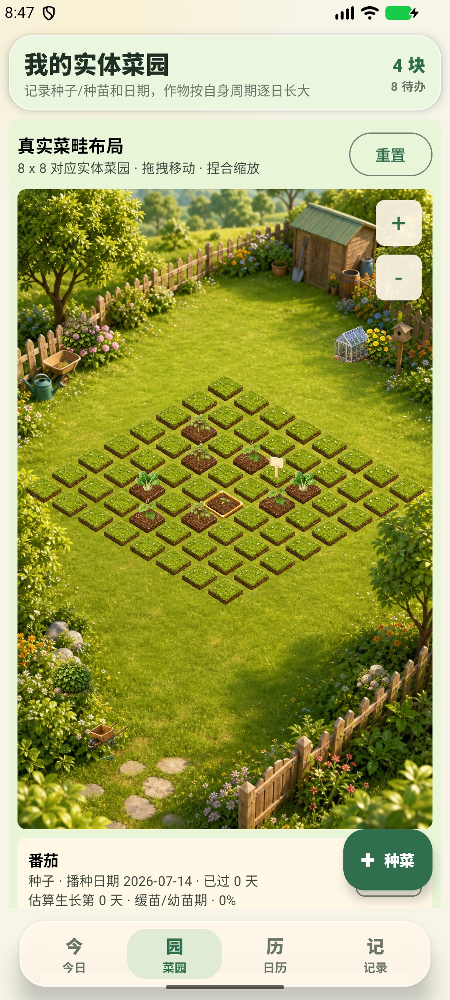
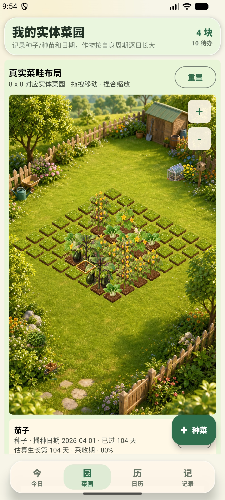
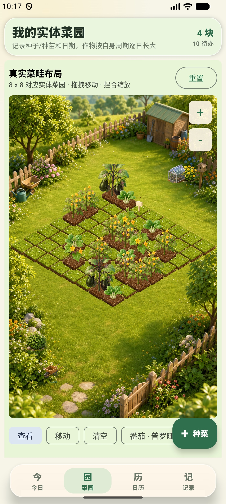
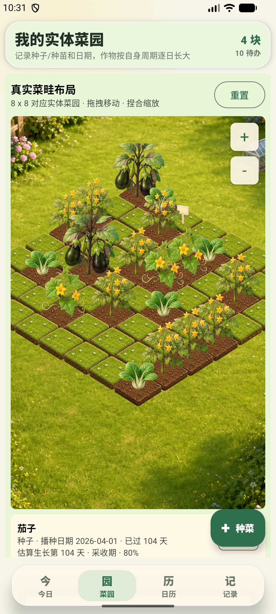

# 2026-07-14 菜园页设备验收记录

## 验收环境

- AVD：`Medium_Phone`
- Android：17
- 分辨率：1080 x 2400
- 密度：420 dpi
- 安装包：`app/build/outputs/apk/debug/app-debug.apk`
- 主渲染路径：`FarmAssetBoard`（Compose Canvas + PNG）

## 结论

当前 2.5D 主路径能够完整显示 8 x 8、点选、拖拽、缩放、平移、旋转和重置。验收时发现“拖到已占用格会删除目标对象”的数据丢失问题；本次已改为交换两个对象，并增加明确提示和数据层单元测试。

种植流程现已要求用户明确选择“种子 / 种苗 / 插条”并记录对应日期；未选择种植方式时不能提交。预测会综合每种作物的完整生长周期、已过天数和种植方式起始偏移。

作物视觉已改为逐菜配置：15 种内置作物分别使用自己的阶段日历、四阶段图片、阶段内尺寸区间、增长曲线、高度、阴影和风吹幅度。番茄、黄瓜、茄子的成熟/采收冠幅提高到约 1.0-1.25 个格子，幼苗保持在约 0.28-0.30 个格子。空心菜和韭菜不再借用菠菜/小葱素材，已补齐各自四张透明阶段图。

现有 `FarmScene3DBoard` 仅适合作为技术 POC。Filament 可以在同一模拟器正常启动并渲染，但现有 GLB 是低模测试资产，作物带高架木框或棚架，且尚未覆盖拖拽换格等完整编辑能力，因此没有替换主渲染路径。

## 实测结果

| 项目 | 结果 | 证据或说明 |
| --- | --- | --- |
| 8 x 8 完整显示 | 通过 | 竖屏内完整显示，无拉伸 |
| 点选正确格 | 通过 | 点选后显示对应作物信息和编辑操作，不再绘制含义不清的木质选中框 |
| 拖到空格 | 通过 | 对象移动到新格，批次和角度保留 |
| 拖到占用格 | 通过（本次修复） | 两个对象交换，菜畦保持 8 个，显示“目标格已有内容，已交换位置” |
| 旋转持久化 | 通过 | `0° -> 15°`，强制结束并重启 App 后仍为 `15°` |
| 放大与平移 | 通过 | `+` 放大后可单指平移，`-` 可回到完整视图 |
| 重置 | 通过 | 恢复 8 个菜畦、1 个标识牌，角度全部回到 `0°` |
| 双指捏合 | 待人工补测 | ADB 本轮无法稳定注入双指手势；按钮缩放和放大后单指平移已实测 |
| 3D POC | 不可交付 | 资产和编辑能力均不满足当前产品约束 |
| 种植方式必选 | 通过 | 新增流程展示种子、种苗、插条；未选择时“开始种植”置灰 |
| 种植日期 | 通过 | 字段会随方式显示播种日期、移栽日期或扦插日期；未来日期不能提交 |
| 方式影响预测 | 通过 | 番茄种苗按常见苗龄补偿 14 天，2026-07-14 移栽时预计 2026-09-13 起可采收 |
| 本地持久化 | 通过 | 实测新增批次保存为 `method=SEED`、`startDate=2026-07-14`，并生成播种记录 |
| 作物逐日长大 | 通过 | 画面使用未取整的生命周期比例；测试覆盖 150 天长周期并确认相邻每一天的尺寸均严格递增；设备中第 0 天番茄嫩芽明显小于早期种下的番茄 |
| 作物周期差异 | 通过 | 进度和采收预测均读取各作物自身阶段与采收周期，不使用统一天数 |
| 逐菜阶段图片 | 通过 | 15 种作物按自身阶段起止日切换 seedling / young / mature / harvest；边界测试覆盖茄子、番茄和黄瓜 |
| 逐菜尺寸曲线 | 通过 | 15 种作物分别配置冠幅区间和 5 类增长曲线，不再共用一条全局缩放曲线 |
| 104 天茄子 | 通过 | 现有播种记录显示“已过 104 天 · 采收期”，画面切换到挂果 harvest 素材，计算冠幅约 1.17 格 |
| 四阶段资源完整性 | 通过 | 运行时使用的 15 种作物 x 4 阶段共 60 张图片均存在并可打包 |
| 田块排列 | 通过 | 每格只绘制草地或土块，不再先铺满草地后把所有土块叠在上面；地形按 `row + column` 深度排序 |
| 远近透视 | 通过 | 单格、作物、结构、命中和拖拽共用同一投影；从远端 `0.88x` 连续增长到近端 `1.08x` |
| 点选木框 | 通过 | 普通点选不再加载或绘制木质选中框；拖拽过程仍保留独立落点提示 |

## 画面证据

### 最终 2.5D 默认画面


### 占用格交换与提示



### 放大后的平移结果



### 现有 3D POC 诊断画面



### 种苗、日期与采收预测



### 第 0 天番茄嫩芽与较早种植作物的尺寸差异



### 第 104 天茄子：采收期挂果与大冠幅



### 收紧田块并移除点选木框



### 透视景深与正确地形分层



## 工程验证

执行：

```bash
./gradlew :app:testDebugUnitTest :app:assembleDebug --no-daemon --console=plain
```

结果：`BUILD SUCCESSFUL`。共执行 14 个单元测试，0 failure、0 error。另执行 `./gradlew :app:lintDebug --no-daemon --console=plain`，结果同样为 `BUILD SUCCESSFUL`。

新增 `FarmLayoutTest` 覆盖：

- 移动到空格时保留批次和旋转数据。
- 移动到占用格时交换两个对象，不丢失任一对象。
- 越界、无源对象和原地移动不修改布局。

新增 `GardenAdvisorTest` 和 `GrowthVisualsTest` 覆盖：

- 同一番茄在种子播种和种苗移栽时得到不同的起始生长日、进度和采收窗口。
- 作物进度会随日期前进，且不同作物使用各自的种苗起始偏移。
- 15 种内置作物都有完整视觉配置，阶段数和日期连续性正确。
- 每一种作物在自身周期内相邻每一天的视觉宽度严格递增，超过周期后正确钳制。
- 茄子、番茄、黄瓜按各自阶段边界切图；茄子第 104 天为 harvest，冠幅约 1.17 格。
- 空心菜与韭菜使用独立素材目录，不再复用其他作物。

## 下一步建议

1. 先制作土壤、叶菜和番茄三类验收级 GLB，各覆盖四个生长阶段；作物模型不得带盆、木框或高架容器。
2. 在 `FarmScene3DBoard` 中完成地面射线命中、拖拽预览、占用格交换、相机边界和视图复位。
3. 3D 路径覆盖现有 2D 的点选、拖拽、缩放、平移、旋转、清空和重置后，再替换主画面。
4. 用真实双指手势补测捏合缩放，并增加 Compose 手势自动化测试。
